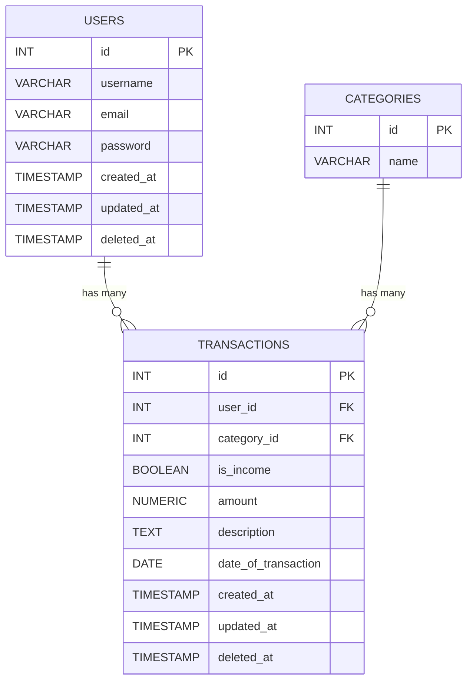

# Entity Relationship Diagram

- The ER diagram has three main tables: **User**, **Expense**, and **Category**.  
- Each **User** can have multiple **Expenses**, and each **Expense** belongs to a single **Category**.  
- The relationships ensure that all data is linked correctly, allowing the system to track user expenses by category efficiently.

**Next:** [Data Flow Diagram ->](Data-Flow.md)