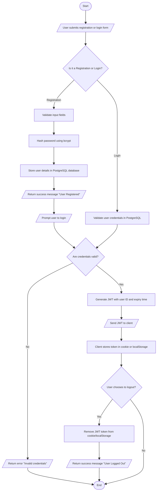
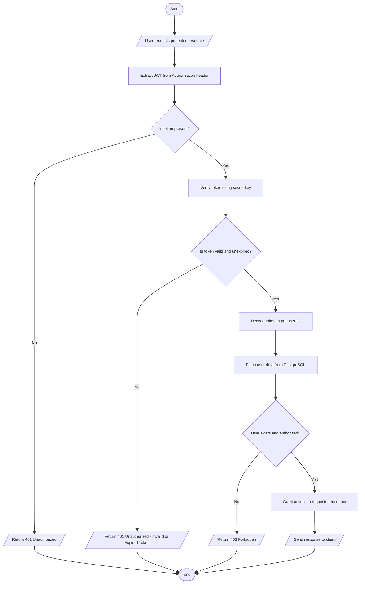

# Authentication Flow

```mermaid
%%{init: {'themeVariables': { 'fontSize': '10px' }}}%%
flowchart TD

A([Start]) --> B[/User submits registration or login form/]
B --> C{Is it a Registration or Login?}

%% Registration path
C -->|Registration| D[Validate input fields]
D --> E[Hash password using bcrypt]
E --> F[Store user details in PostgreSQL database]
F --> G[/Return success message "User Registered"/]
G --> H[/Prompt user to login/]
H --> J

%% Login path
C -->|Login| I[Validate user credentials in PostgreSQL]
I --> J{Are credentials valid?}
J -->|No| K[/Return error "Invalid credentials"/]
K --> O
J -->|Yes| L[Generate JWT with user ID and expiry time]
L --> M[/Send JWT to client/]
M --> N[Client stores token in cookie or localStorage]

%% Logout path
N --> P{User chooses to logout?}
P -->|Yes| Q[Remove JWT token from cookie/localStorage]
Q --> R[/Return success message "User Logged Out"/]
R --> O([End])
P -->|No| O([End])
```

# Authorization Flow

```mermaid
%%{init: {'themeVariables': { 'fontSize': '10px' }}}%%
flowchart TD

A([Start]) --> B[/User requests protected resource/]
B --> C[Extract JWT from Authorization header]
C --> D{Is token present?}

D -->|No| E[/Return 401 Unauthorized/]
E --> O([End])

D -->|Yes| F[Verify token using secret key]
F --> G{Is token valid and unexpired?}

G -->|No| H[/Return 401 Unauthorized - Invalid or Expired Token/]
H --> O([End])

G -->|Yes| I[Decode token to get user ID]
I --> J[Fetch user data from PostgreSQL]
J --> K{User exists and authorized?}

%% Forbidden Path
K -->|No| L[/Return 403 Forbidden/]
L --> O([End])

%% Access Granted Path
K -->|Yes| M[Grant access to requested resource]
M --> N[/Send response to client/]
N --> O([End])
```

**Next:** [Architecture ->](architecture.md)