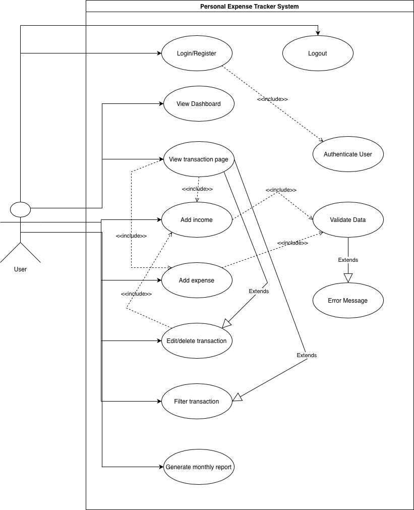

# Business Use Cases

Below are the key business use cases for the **Personal Expense Tracker** application.  

---

## 1. Manage Personal Finances

| **Attribute** | **Description** |
|----------------|-----------------|
| **Business Objective** | Enable users to track and manage their income and expenses efficiently. |
| **Actor** | User |
| **Pre-condition** | User has registered and logged in successfully. |
| **Main Flow** | 1. User records income and expenses under some category. 2. System stores the transactions. 3. User views summary through the dashboard. |
| **Post-condition** | User gains visibility into spending and overall financial health. |
| **Business Value** | Increases financial discipline and decision-making through organized record-keeping. |

---

## 2. Analyze Spending Patterns

| **Attribute** | **Description** |
|----------------|-----------------|
| **Business Objective** | Provide users with insights into their spending habits. |
| **Actor** | User |
| **Pre-condition** | Transaction data exists in the system. |
| **Main Flow** | 1. System aggregates data by category and date. 2. Generates pie charts for monthly expense. 3. Displays insights on dashboard. |
| **Post-condition** | User identifies major expense areas and adjusts habits. |
| **Business Value** | Encourages smarter budgeting and financial awareness. |

---

## 3. Generate Monthly Financial Reports

| **Attribute** | **Description** |
|----------------|-----------------|
| **Business Objective** | Allow users to generate and export monthly expense reports for personal or professional use. |
| **Actor** | User |
| **Pre-condition** | Minimum one month of data is recorded. |
| **Main Flow** | 1. User selects the month for which report is needed. 2. System compiles transactions into a summarized PDF. 3. Report is made available for download. |
| **Post-condition** | PDF report downloaded or shared. |
| **Business Value** | Provides documentation for budgeting purposes.|

---

# Technical Use Cases

Below are the detailed technical use cases for the **Personal Expense Tracker** application.

---
   
## 1. Register Account

| **Attribute** | **Description** |
|----------------|-----------------|
| **Actor** | User |
| **Pre-condition** | No existing account. |
| **Main Flow** | 1. User clicks “Register”. 2. Inputs email & password. 3. System validates and stores credentials. |
| **Post-condition** | Account created; redirect to login page. |

---

## 2. Login

| **Attribute** | **Description** |
|----------------|-----------------|
| **Actor** | User |
| **Pre-condition** | Valid credentials exist. |
| **Main Flow** | 1. User enters email and password. 2. System authenticates. 3. Redirect to Dashboard. |
| **Post-condition** | User session started. |

---

### 3. Authenticate User
| Attribute | Description |
|------------|-------------|
| **Actor** | System |
| **Pre-condition** | User provides valid login credentials. |
| **Main Flow** | 1. System receives credentials from login form. 2. Validates credentials against database. 3. Generates JWT token for session handling. |
| **Post-condition** | Authentication token issued for secure session management. |

---

## 4. View Dashboard

| **Attribute** | **Description** |
|----------------|-----------------|
| **Actor** | User |
| **Pre-condition** | Logged in. |
| **Main Flow** | 1. System loads Overview Dashboard. 2. Displays income, weekly expenses (pie chart), last month summary, and recent transactions. |
| **Post-condition** | User views financial snapshot. |

---

## 5. Add Income/Expense

| **Attribute** | **Description** |
|:---------------|:----------------|
| **Actor** | User |
| **Pre-condition** | Logged in. |
| **Main Flow** | 1. Navigate to Transactions page. 2. Click **(Add Transaction)**. 3. Select **type** (Income or Expense). 4. Enter details (amount, category, date, description). 5. Click **“Save.”** |
| **Post-condition** | Transaction recorded and dashboard updated. |

---

### 6. Validate Data
| Attribute | Description |
|------------|-------------|
| **Actor** | System |
| **Pre-condition** | User provides input while creating or editing transactions. |
| **Main Flow** | 1. Check if mandatory fields (amount, category, date) are filled. 2. Validate data format and numeric values. 3. Ensure no invalid or empty entries are accepted. |
| **Post-condition** | Data verified before storing in database. |

---

## 7. Edit or Delete Transaction

| **Attribute** | **Description** |
|----------------|-----------------|
| **Actor** | User |
| **Pre-condition** | User is on the Transactions page with an existing transaction list. |
| **Main Flow** | 1. Select transaction. 2. Edit details → Edit OR Click Delete → Confirm. 3. System updates or removes record. |
| **Post-condition** | Data updated in database and UI. |

---

## 8. Filter Transactions

| **Attribute** | **Description** |
|----------------|-----------------|
| **Actor** | User |
| **Pre-condition** | User is on the Transactions page with an existing transaction list. |
| **Main Flow** | 1. On the Transactions page, filter the transaction based on category. 2. System automatically updates and displays the filtered transactions. |
| **Post-condition** | Filtered transaction list displayed on the Transactions page. |

---

## 9. Generate Monthly Report

| **Attribute** | **Description** |
|----------------|-----------------|
| **Actor** | User |
| **Pre-condition** | At least one month’s transactions. |
| **Main Flow** | 1. Navigate to Import/Export. 2. Select month. 3. System fetches and aggregates data. 4. PDF report generated for download. |
| **Post-condition** | Report saved locally or viewed on-screen. |

---

## 10. Logout

| **Attribute** | **Description** |
|----------------|-----------------|
| **Actor** | User |
| **Pre-condition** | Active session. |
| **Main Flow** | 1. Click “Sign Out”. 2. System terminates session and redirects to login. |
| **Post-condition** | User logged out securely. |

---

# Use Case Diagram

